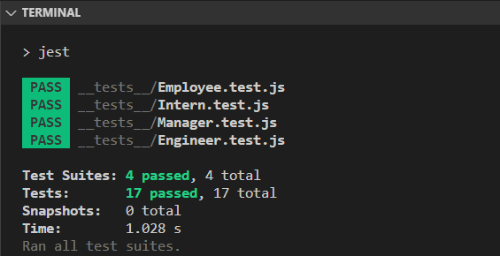
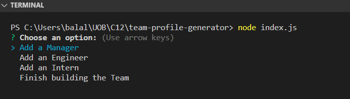
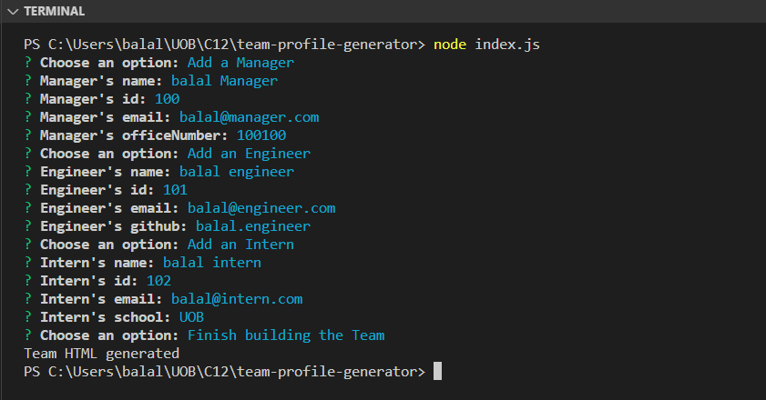
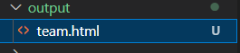
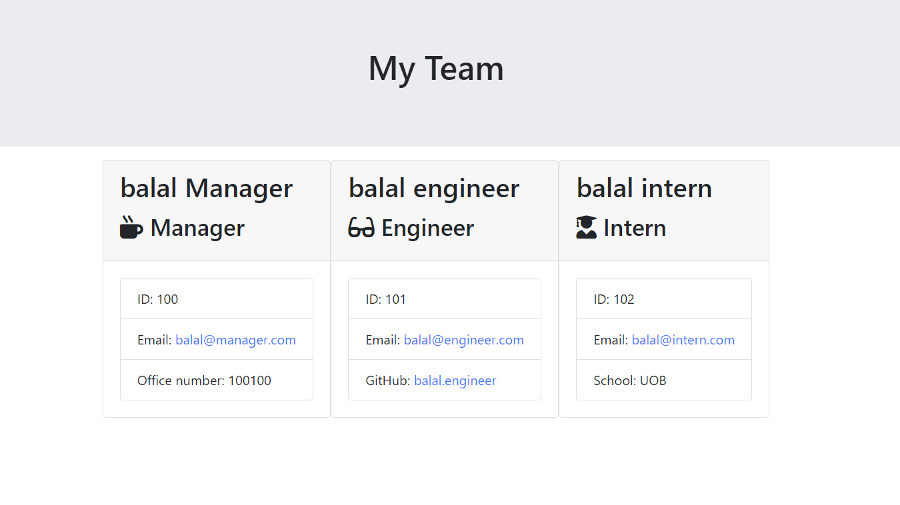

# Team Profile Generator

A team profile generator that uses the command line to allow users to create a webpage which displays a team and its team members.
You can set the roles of your team, from the following: Manager, Employee, and Intern. The application will then generate an HTML page with the information which you have provided.

A set of four test suites were tested against the code. This passed successfully.

## Instructions

1. Clone this repositry to local machine
2. Go to the repository's directory on your machine
3. Install the required dependencies on your terminal. By doing the following: npm install inquirer@8.2.2 for testing: npm install jest.
4. Use your terminal to run the following command : node index.js. Select your needed team members and it will create a new team profile for you in the output Folder.
5. To run tests type npm test

## Images

Test Passing

Options

Using the team profile generator

Output folder

Generated Team Profile

## Link

- [Link for repository](https://github.com/balalsaleh/team-profile-generator)
